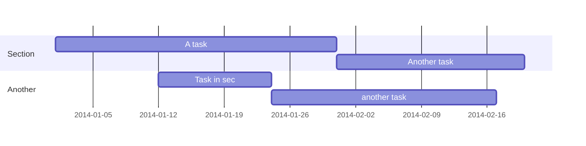

# Test

testing if it works or not [asd](https://twitter.com/Twitter')

## Test2

### Test3

#### Test4
```
```


# Test




<svg xmlns="http://www.w3.org/2000/svg" xmlns:xlink="http://www.w3.org/1999/xlink" version="1.1" width="93px" viewBox="-0.5 -0.5 93 296" content="&lt;mxfile host=&quot;app.diagrams.net&quot; modified=&quot;2022-07-05T23:49:42.549Z&quot; agent=&quot;5.0 (X11)&quot; etag=&quot;6oOcEOjFDTp2_Jr1WZTA&quot; version=&quot;20.0.1&quot;&gt;&lt;diagram id=&quot;UmV8kXpqfnANdtDW0Tiv&quot; name=&quot;Page-1&quot;&gt;zVZNc9owEP01HMvgD2g4JoSEQzpDh0zSnjoCCVut7HXkNdj99ZWwZFt1QmBKZ3JhtE9PWknv7eJBMEvKe0my+AtQJgb+iJaD4Hbg+5Nwon41UNVAGHyugUhyWkNeC6z4b2bAkUELTlnuEBFAIM9ccANpyjboYERK2Lu0LQg3a0Yi1gNWGyL66DOnGNfo1XjU4gvGo9hm9kZmJiGWbIA8JhT2HSiYD4KZBMB6lJQzJvTb2Xep1929MdscTLIUT1lw/xgViyxMvr5Uj6vnuxe+IPAprHfZEVGYC5vDYmVfgFH1ICYEiTFEkBIxb9EbCUVKmU4zUlHLeQDIFOgp8CdDrIy6pEBQUIyJMLN1Tp3ozbsZKIdCbtiRC1mPEBkxPMLzGwWUcxkkDGWl1kkmCPKdew5iPBQ1PLP0WkpSdQgZ8BTzzs5LDSiCqYZgYrxgiiG4mrqS9fj+Mb4a1CewUecqLXSwwRmW8N63xI5J5KpGHsiaiSXkHDmkamoNiJAoQRuva0NQkseNO4jgkaZulLJMujaw214bDmr76L0ynTcpI91hhkyoOpeaN0RJ0pznCDIfpgkoFW4OEjA53zGtRNdeendWHjdY3xBWiZGrnG+V3LdNwUJxtx/Yda95qKPj+TL578v02lt8FOlyxSPiR13PuQ2jQyu5kGTB1JEs9PuSheO+ZMH/UmzyIXqtej1ZfesG381mh+C2dKKqGy2Z5OoptPYH8IJte3xi235D8pPb9j8JOO4J+DTwJwK104u1GkZ6SKkFVZIOfnIXrWvn74rqFuiJRbWj9LyCzlHCr+Y7RxtkCykaK/mha6St4NnTBTts4A3HTsF609N6bHh+waqw/fCq/zjbr9dg/gc=&lt;/diagram&gt;&lt;/mxfile&gt;" onclick="(function(svg){var src=window.event.target||window.event.srcElement;while (src!=null&amp;&amp;src.nodeName.toLowerCase()!='a'){src=src.parentNode;}if(src==null){if(svg.wnd!=null&amp;&amp;!svg.wnd.closed){svg.wnd.focus();}else{var r=function(evt){if(evt.data=='ready'&amp;&amp;evt.source==svg.wnd){svg.wnd.postMessage(decodeURIComponent(svg.getAttribute('content')),'*');window.removeEventListener('message',r);}};window.addEventListener('message',r);svg.wnd=window.open('https://viewer.diagrams.net/?client=1&amp;page=0&amp;edit=_blank');}}})(this);" style="cursor:pointer;max-width:100%;max-height:296px;"><defs/><g><path d="M 60 202.14 L 60 234 L 62 234 L 62 258.63" fill="none" stroke="rgb(0, 0, 0)" stroke-miterlimit="10" pointer-events="stroke"/><path d="M 62 263.88 L 58.5 256.88 L 62 258.63 L 65.5 256.88 Z" fill="rgb(0, 0, 0)" stroke="rgb(0, 0, 0)" stroke-miterlimit="10" pointer-events="all"/><rect x="0" y="105" width="60" height="100" fill="none" stroke="none" pointer-events="all"/><path d="M 0 155 L 35.14 155" fill="none" stroke="rgb(0, 0, 0)" stroke-miterlimit="10" pointer-events="all"/><path d="M 35.14 137.86 L 35.14 172.14" fill="none" stroke="rgb(0, 0, 0)" stroke-miterlimit="10" pointer-events="all"/><path d="M 60 107.86 L 60 137.86 L 38.57 137.86 L 38.57 172.14 L 60 172.14 L 60 202.14" fill="none" stroke="rgb(0, 0, 0)" stroke-miterlimit="10" pointer-events="all"/><rect x="0" y="107.86" width="0" height="0" fill="none" stroke="rgb(0, 0, 0)" pointer-events="all"/><path d="M 46.29 167.86 L 59.14 172.14 L 46.29 176.43 Z" fill="rgb(255, 255, 255)" stroke="rgb(0, 0, 0)" stroke-miterlimit="10" pointer-events="all"/><rect x="39" y="265" width="45" height="30" fill="none" stroke="none" pointer-events="all"/><path d="M 39 275 L 61.5 295 L 84 275 Z" fill="rgb(255, 255, 255)" stroke="rgb(0, 0, 0)" stroke-miterlimit="10" pointer-events="all"/><path d="M 61.5 265 L 61.5 275" fill="none" stroke="rgb(0, 0, 0)" stroke-miterlimit="10" pointer-events="all"/><path d="M 61.51 75 L 61.51 95.02 L 60 95.02 L 60 101.49" fill="none" stroke="rgb(0, 0, 0)" stroke-miterlimit="10" pointer-events="stroke"/><path d="M 60 106.74 L 56.5 99.74 L 60 101.49 L 63.5 99.74 Z" fill="rgb(0, 0, 0)" stroke="rgb(0, 0, 0)" stroke-miterlimit="10" pointer-events="all"/><path d="M 31.5 75 L 91.5 75 M 61.5 75 L 61.5 35" fill="none" stroke="rgb(0, 0, 0)" stroke-miterlimit="10" transform="translate(0,55)scale(1,-1)translate(0,-55)" pointer-events="all"/><g transform="translate(-0.5 -0.5)"><switch><foreignObject style="overflow: visible; text-align: left;" pointer-events="none" width="100%" height="100%" requiredFeatures="http://www.w3.org/TR/SVG11/feature#Extensibility"><div xmlns="http://www.w3.org/1999/xhtml" style="display: flex; align-items: unsafe flex-end; justify-content: unsafe center; width: 1px; height: 1px; padding-top: 32px; margin-left: 61px;"><div style="box-sizing: border-box; font-size: 0px; text-align: center;" data-drawio-colors="color: rgb(0, 0, 0); "><div style="display: inline-block; font-size: 24px; font-family: Helvetica; color: rgb(0, 0, 0); line-height: 1.2; pointer-events: all; white-space: nowrap;">V<sub>dd</sub></div></div></div></foreignObject><text x="61" y="32" fill="rgb(0, 0, 0)" font-family="Helvetica" font-size="24px" text-anchor="middle">Vdd</text></switch></g></g><switch><g requiredFeatures="http://www.w3.org/TR/SVG11/feature#Extensibility"/><a transform="translate(0,-5)" xlink:href="https://www.diagrams.net/doc/faq/svg-export-text-problems" target="_blank"><text text-anchor="middle" font-size="10px" x="50%" y="100%">Text is not SVG - cannot display</text></a></switch></svg>

testing if it works or not

## Test2

### Test3

#### Test4


```python
# Example of code highlighting
input_string_var = input("Enter some data: ")
print("You entered: {}".format(input_string_var))
```

$$\left [ – \frac{\hbar^2}{2 m} \frac{\partial^2}{\partial x^2} + V \right ] \Psi = i \hbar \frac{\partial}{\partial t} \Psi$$

This is inline: $\mathbf{y} = \mathbf{X}\boldsymbol\beta + \boldsymbol\varepsilon$
